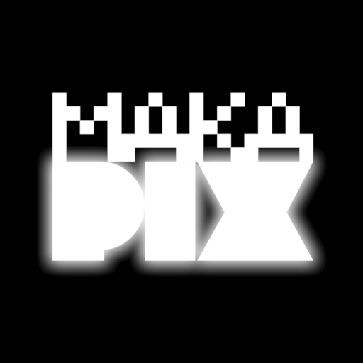
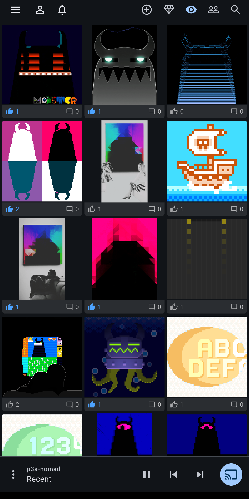
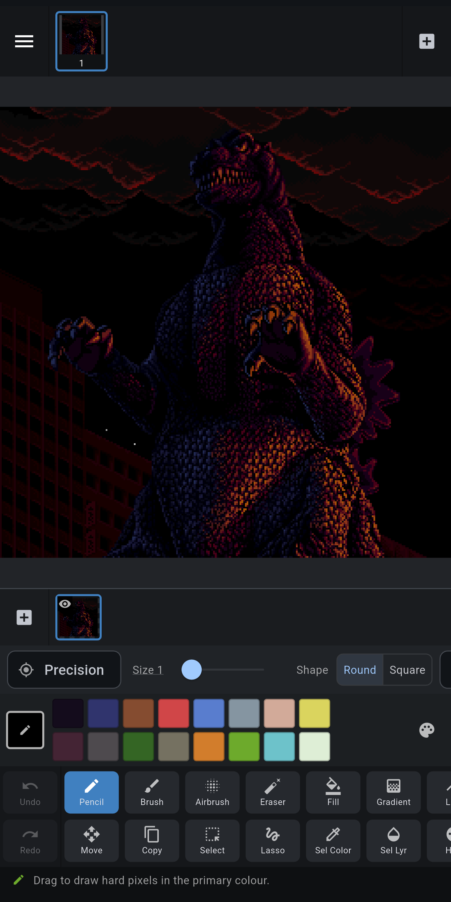
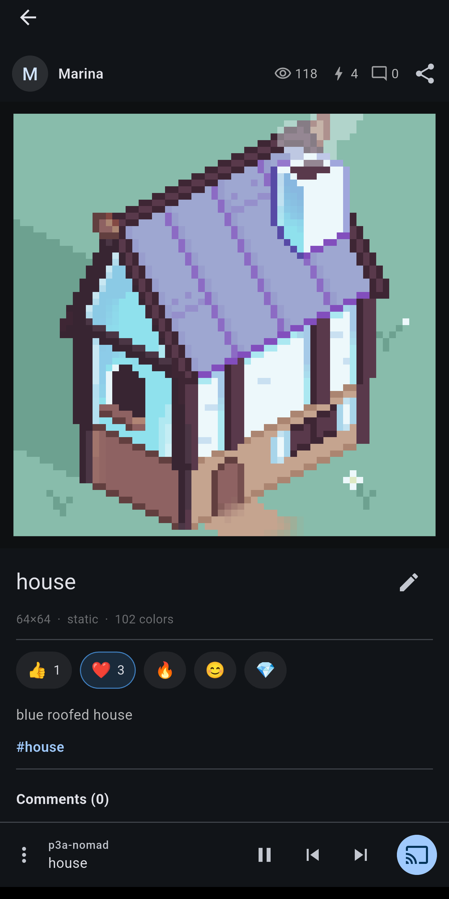

# Makapix Club

**Draw, animate, and share pixel art — right from your phone.**

&nbsp;&nbsp;

*Also on the web at [makapix.club](https://makapix.club)*

---

  &nbsp;
  &nbsp;
  

## What is Makapix Club?

Makapix Club is a community built around one thing: **pixel art**. People draw it, post it, react to
it, remix it, and even play it on real pixel-art displays. This app is the club in your pocket — a
fast, native app for iOS and Android with a complete animated-pixel-art studio built in.

And if you just want to draw? Go ahead. **The editor works fully offline, no account needed.**

## 🎨 Draw

The built-in **Makapix Editor** is a serious tool for making animated pixel art:

- **Animation first** — up to 1024 frames on a thumbnail timeline, with live playback while you edit.
- **Room to work** — canvases up to 256×256, up to 64 layers, and deep undo (128 steps per frame).
- **A full toolbox** — pencil, brush, airbrush, eraser, fill, gradient, dodge & burn, HSV and
  brightness adjustment, flip, rotate, resize, rectangle/oval/lasso selections, move & copy, a color
  picker, and a ruler that measures distances and angles.
- **Palettes that matter** — a full-screen palette manager with color naming, smart sorting, and
  `.gpl` palette import.
- **Bring anything in, take anything out** — import GIF, PNG, APNG, WebP, JPEG, and BMP; export PNG,
  sprite sheets, animated GIF, and lossless animated WebP.
- **Never lose work** — every drawing autosaves to your on-device gallery as you go.

## 🌐 Share

The Club is the social half of the app — the same community you see at
[makapix.club](https://makapix.club), so anything you post from your phone is instantly on the web too:

- Browse **feeds** of fresh and promoted artwork, follow trending **hashtags**, and **search** for
  art and artists.
- **React** with emoji, **comment**, and **follow** the artists you love.
- **Publish straight from the editor** — pick a title, tags, a license, and go.
- **Remix** — open a remixable artwork right in the editor, make it yours, and post your take.
- Build your **profile** with highlights, and keep up through **notifications**.

## 📺 Put it on a real display

Pixel art deserves better than a browser tab. Makapix Club supports **players** — networked
pixel-art displays that show artwork from the Club. Register your player in the app, then use the
Player Bar to beam any artwork you're looking at straight onto the display on your shelf.

## Under the hood

For the technically curious: the editor is a deterministic, dependency-free **Rust** engine under a
**Flutter** shell, speaking over a hand-written C FFI — the same engine on iOS, Android, and Windows,
plus a headless CLI that drives the test suite. It renders integer-exact, so an artwork is
byte-for-byte identical on every platform, and it ships with memory budgets measured on real devices
([docs/memlab/REPORT.md](docs/memlab/REPORT.md)). Drawings are stored in `.mkpx`, a lossless,
versioned container format documented in [docs/mkpx-format/](docs/mkpx-format/).

## Build from source

The store builds above are the easy path; Windows (and any tinkering) is source-only. See
**[docs/BUILDING.md](docs/BUILDING.md)** for Windows, Android, and iOS build instructions, the
developer documentation map, and the project's design principles.

## License

[Apache-2.0](LICENSE).

Apple, the Apple logo, and App Store are trademarks of Apple Inc. Google Play and the Google
Play logo are trademarks of Google LLC. Artwork in the screenshots belongs to the Makapix Club
artists who posted it.
